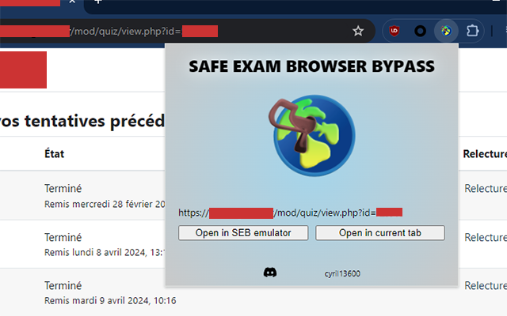
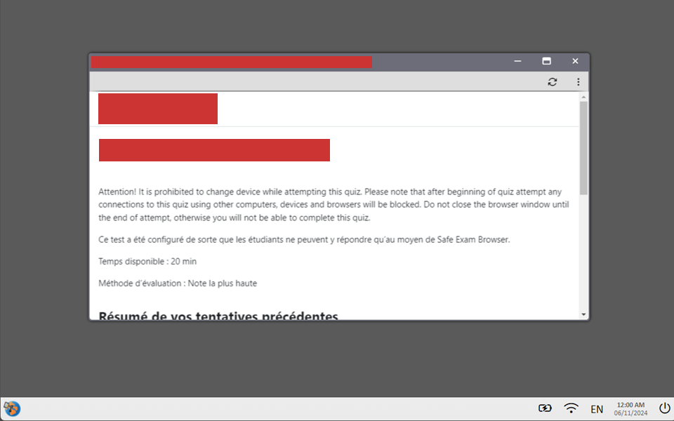

# SEB Bypass
The Chrome extension "SEB Bypass" allows you to bypass the execution of quizzes in Safe Exam Browser (SEB). This extension allows users to take a Moodle quiz directly in their current browser instead of having to go through SEB's secure environment. It therefore offers a practical alternative for those who prefer to use their own browser or who encounter difficulties with SEB.


*Extension popup*


*"Emulation" mode reproducing the SEB interface in the browser*

## Installation Instructions

Follow these steps to clone the repository and install the extension in your Chrome browser as an unpacked extension.

### Step 1: Clone the Repository

First, open your terminal and run the following command to clone the GitHub repository:

```sh
git clone https://github.com/cycyrild/seb-bypass.git
```

This command will create a directory named `seb-bypass` in your current working directory.

### Step 2: Open Chrome Extensions Page

1. Open Google Chrome.
2. Go to the Extensions page by navigating to `chrome://extensions/` in the address bar.
3. Enable "Developer mode" by toggling the switch in the top right corner of the page.

### Step 3: Load the Unpacked Extension

1. Click the "Load unpacked" button.
2. In the file dialog, navigate to the directory where you cloned the repository (`seb-bypass`), and select it.
3. Click "Select Folder" (or "Open" on macOS).

The extension should now be loaded into Chrome and ready to use.
